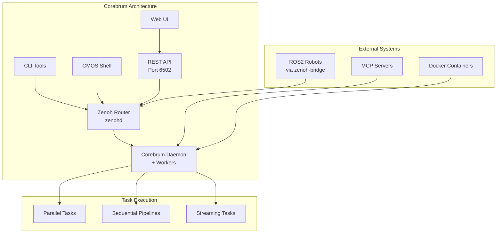

# Corebrum Getting Started Developer Guide

Welcome to the Corebrum Getting Started Developer Guide! This comprehensive guide will help you understand, install, configure, and use Corebrum - the mesh supercomputer platform for decentralized computing.

## Table of Contents

1. [Introduction & Architecture Overview](#1-introduction--architecture-overview)
2. [Installation & Setup](#2-installation--setup)
3. [Building with Claude Code](#3-building-with-claude-code)
4. [Zenoh Configuration & Deployment](#4-zenoh-configuration--deployment)
5. [Corebrum Daemon & Workers](#5-corebrum-daemon--workers)
6. [Corebrum CLI](#6-corebrum-cli)
7. [Corebrum CMOS (Interactive Shell)](#7-corebrum-cmos-interactive-shell)
8. [Corebrum REST API](#8-corebrum-rest-api)
9. [Corebrum Web UI](#9-corebrum-web-ui)
10. [Task Definition Structure](#10-task-definition-structure)
11. [Parallel Computing Examples](#11-parallel-computing-examples)
12. [Sequential Computing Examples](#12-sequential-computing-examples)
13. [Streaming Tasks](#13-streaming-tasks)
14. [MCP (Model Context Protocol) Integration](#14-mcp-model-context-protocol-integration)
15. [ROS2 + Corebrum: Physical AI Robotics](#15-ros2--corebrum-physical-ai-robotics)
16. [Corebrum Cortex: Identity, Memory, and Hiveminds](#16-corebrum-cortex-identity-memory-and-hiveminds)
17. [Storage System](#17-storage-system)
18. [Advanced Features](#18-advanced-features)
19. [Best Practices & Patterns](#19-best-practices--patterns)
20. [Quick Reference](#20-quick-reference)
21. [Next Steps & Resources](#21-next-steps--resources)

**Agent integration test scripts:** [scripts/agents/README.md](./scripts/agents/README.md) — shell checks for OpenClaw, Claude (HTTP + optional MCP), and Gemini; overview also in [§14 MCP](#14-mcp-model-context-protocol-integration).

**Example layout:** General mesh task definitions are under [`task_definitions/`](task_definitions/). Bundles that require **Corebrum Cortex** (identity, memory, hive, OpenClaw) are under [`cortex/task_definitions/`](cortex/task_definitions/) — start at [`cortex/README.md`](cortex/README.md).

**Hands-on commands** (Zenoh, daemon, CMOS, ROS2, streams, REST, Cortex paths from a sibling `corebrum` checkout): [`CHEATSHEET.md`](CHEATSHEET.md).

---

## 1. Introduction & Architecture Overview

### What is Corebrum?

Corebrum is a **mesh supercomputer** platform that enables decentralized, distributed computing across a network of devices. It transforms any collection of connected machines into a powerful, unified computing resource capable of executing tasks in parallel, sequentially, or as long-running streams.

### Core Concepts

- **Mesh Computing**: Distributed computing where tasks can execute on any available worker in the network
- **Decentralized Execution**: No central coordinator - workers discover and claim tasks autonomously
- **Zenoh Networking**: Built on Zenoh for efficient, low-latency communication
- **Cognitive Computing**: Identity, memory, and collaborative learning through the Corebrum Cortex

### Architecture Overview



### Key Features

- **Multi-language Support**: Python, JavaScript, Rust, Docker, WebAssembly
- **Task Types**: Parallel, sequential, and streaming execution modes
- **ROS2 Integration**: Native bi-directional ROS2 message handling
- **Cognitive Layer**: Identity, memory, and hive systems for learning robots
- **Storage Backends**: Filesystem, RocksDB, InfluxDB support
- **REST API & Web UI**: Complete programmatic and visual interfaces

### Use Cases

- **Scientific Computing**: Distributed simulations and data analysis
- **AI/ML Workloads**: Parallel model training and inference
- **Robotics**: Real-time sensor processing and control
- **Edge Computing**: Distributed processing across IoT devices
- **Data Pipelines**: ETL workflows and data transformation

---

## 2. Installation & Setup

### System Requirements

- **Operating System**: Linux, macOS, or Windows (WSL2)
- **Rust**: 1.70+ (for building from source)
- **Docker**: Optional, for container-based tasks
- **Network**: TCP/IP connectivity for mesh networking

### Installation Methods

#### Method 1: APT Package (Linux)

```bash
# Add Corebrum APT repository
echo "deb [trusted=yes] https://corebrum.github.io/corebrum/apt-repo/ stable main" | sudo tee /etc/apt/sources.list.d/corebrum.list

# Update package list
sudo apt update

# Install Corebrum
sudo apt install corebrum
```

#### Method 2: Homebrew (macOS)

```bash
# Add Corebrum tap
brew tap corebrum/corebrum

# Install Corebrum
brew install corebrum
```

#### Method 3: Windows (Direct Download)

```bash
# Download Corebrum for Windows
# Direct download: https://corebrum-releases.s3.amazonaws.com/releases/v0.2.112/corebrum-x86_64-pc-windows-msvc.zip

# Extract the zip file
# Add corebrum.exe to your PATH environment variable
```

**Windows Installation Steps:**
1. Download the corebrum-x86_64-pc-windows-msvc.zip file from: https://github.com/Corebrum/corebrum/releases 
2. Extract the zip file to a directory (e.g., `C:\Program Files\Corebrum`)
3. Add the directory containing `corebrum.exe` to your PATH:
   - Open System Properties → Environment Variables
   - Edit the `Path` variable in User or System variables
   - Add the directory path (e.g., `C:\Program Files\Corebrum`)
   - Click OK to save

#### Method 4: From Source

```bash
# Clone the repository
git clone https://github.com/corebrum/corebrum.git
cd corebrum

# Build Corebrum
cargo build --release

# Install (optional)
cargo install --path .
```

#### Method 5: Python Library (PyPI)

Install the Corebrum Python library to execute Python code on Corebrum's distributed infrastructure:

```bash
pip install corebrum
```

**Quick Start:**
```python
import corebrum

# Configure Corebrum connection
corebrum.configure(base_url="http://localhost:6502")

# Decorate function to run on Corebrum
@corebrum.run()
def process_data(data):
    import pandas as pd
    df = pd.DataFrame(data)
    return df.describe().to_dict()

# Call normally - executes on Corebrum
result = process_data([{"x": 1, "y": 2}, {"x": 3, "y": 4}])
```

**Features:**
- Transparent execution: Code runs as if local, but executes on Corebrum
- Automatic dependency detection and installation
- Workers automatically install missing Python packages (e.g., pandas, numpy)
- Two usage patterns: Decorator (`@corebrum.run()`) and raw code execution (`corebrum.execute()`)
- Error handling with Python exceptions
- Identity and memory support

**Documentation:** [https://github.com/Corebrum/corebrum-pip](https://github.com/Corebrum/corebrum-pip)  
**PyPI Package:** [https://pypi.org/project/corebrum/](https://pypi.org/project/corebrum/)

### Verify Installation

```bash
# Check Corebrum version
corebrum --version

# View help
corebrum --help

# List available commands
corebrum help
```

### Initial Configuration

Corebrum uses sensible defaults and typically requires no initial configuration. The default Zenoh router endpoint is `tcp://127.0.0.1:7447` for local development.

You can override the Zenoh router endpoint using the `--zenoh-router` flag:

```bash
corebrum daemon --zenoh-router tcp://your-router:7447
```

---

## 3. Building with Claude Code

[Claude Code](https://claude.com/product/claude-code) is an AI-powered development environment that can help you build and run Corebrum applications interactively. With Claude Code, you can describe what you want to build in natural language, and Claude will help you create task definitions, write code, and execute your Corebrum apps.

### Getting Started with Claude Code

1. **Clone the repository:**
   ```bash
   git clone git@github.com:Corebrum/corebrum-examples.git
   cd corebrum-examples
   ```

2. **Launch Claude Code:**
   ```bash
   claude
   ```

3. **Ask Claude to build a Corebrum app:**
   At the Claude Code prompt, describe what you want to build. For example:
   ```
   help me build and run a corebrum app that calculates pi out to 5 decimals
   ```

4. **Approve Claude's actions:**
   Answer **YES** to Claude's requests to fix and run commands. Claude will:
   - Create task definition files (YAML/JSON)
   - Write the necessary code
   - Submit tasks to Corebrum
   - Monitor execution and retrieve results

### Example Workflow

**Initial Request:**
```
help me build and run a corebrum app that calculates pi out to 5 decimals
```

Claude will:
- Create a task definition file (e.g., `task_definitions/python/pi_calculation.yaml`)
- Write Python code to calculate π using a method like the Leibniz formula or Monte Carlo
- Submit the task using `corebrum submit`
- Wait for completion and display results

**Iterative Refinement:**
```
now run it out to 10 decimals
```

Claude will modify the task definition and resubmit with updated parameters.

### Benefits of Using Claude Code

- **Natural Language Interface**: Describe what you want in plain English
- **Interactive Development**: Iterate on your apps through conversation
- **Automatic Code Generation**: Claude writes task definitions and code for you
- **Error Handling**: Claude fixes issues and retries automatically
- **Learning Tool**: See how Corebrum apps are structured by watching Claude build them

### Prerequisites

- Claude Code installed and configured
- Corebrum daemon running (see [Section 5: Corebrum Daemon & Workers](#5-corebrum-daemon--workers))
- Zenoh router running (see [Section 4: Zenoh Configuration & Deployment](#4-zenoh-configuration--deployment))

### Example Task Definitions Created by Claude

Claude can create various types of Corebrum tasks:
- **Mathematical computations**: Factorial, Fibonacci, π calculation
- **Data processing**: CSV parsing, JSON transformation
- **Parallel tasks**: Multiple independent computations
- **Sequential pipelines**: Multi-stage data processing
- **Streaming tasks**: Real-time data processing

### Tips for Best Results

1. **Be Specific**: Clearly describe what you want the app to do
2. **Provide Context**: Mention if you want parallel execution, specific precision, etc.
3. **Iterate**: Ask Claude to modify or improve the app after initial creation
4. **Review Generated Code**: Check the task definitions Claude creates to learn the structure

### Reference

For a detailed walkthrough and examples, see the Medium article:
**[Building and running Corebrum apps with Claude Code!](https://medium.com/corebrum/building-and-running-corebrum-apps-with-claude-code-e7929c47ce68)**

---

## 4. Zenoh Configuration & Deployment

### What is Zenoh?

Zenoh is a high-performance, distributed pub/sub and storage system that Corebrum uses for networking. It provides:

- **Low-latency messaging**: Efficient pub/sub communication
- **Storage backends**: Persistent storage for data and state
- **Network abstraction**: Seamless local and distributed networking

### Installing Zenoh Router

#### macOS (Homebrew)

```bash
# Install Zenoh using Homebrew
brew install zenoh
```

#### Windows

**Option 1: Download Pre-built Binary**
1. Download from GitHub releases: https://github.com/eclipse-zenoh/zenoh/releases
2. Extract the zip file
3. Add `zenohd.exe` to your PATH environment variable

**Option 2: Using Cargo (if Rust is installed)**
```bash
cargo install zenoh
```

#### Linux (APT - Debian/Ubuntu)

```bash
# Add Zenoh APT repository
sudo sh -c 'echo "deb [trusted=yes] https://download.eclipse.org/zenoh/debian/ stable main" > /etc/apt/sources.list.d/zenoh.list'

# Update package list
sudo apt update

# Install Zenoh
sudo apt install zenoh
```

#### Linux / All Platforms (Alternative Methods)

**Using Cargo:**
```bash
cargo install zenoh
```

**Or download from GitHub releases:**
- https://github.com/eclipse-zenoh/zenoh/releases

### Basic Zenoh Configuration

Start Zenoh router with default configuration:

```bash
zenohd
```

The router will start on `tcp://127.0.0.1:7447` by default.

### Storage Backends

Corebrum supports multiple Zenoh storage backends for persistence:

#### Filesystem Backend

Simple file-based storage for development:

```bash
# Start zenohd with filesystem backend
zenohd --config /path/to/corebrum/docs/zenoh_configs/zenohd-filesystem.json5
```

#### RocksDB Backend

High-performance key-value storage for production:

```bash
# Start zenohd with RocksDB backend
zenohd --config /path/to/corebrum/docs/zenoh_configs/zenohd-rocksdb.json5
```

#### InfluxDB Backend

Time-series database for metrics and temporal data:

```bash
# Start InfluxDB first
influxd

# Then start zenohd with InfluxDB backend
zenohd --config /path/to/corebrum/docs/zenoh_configs/zenohd-influxdb.json5
```

#### Multi-Backend Configuration

Use different backends for different data types:

```bash
zenohd --config /path/to/corebrum/docs/zenoh_configs/zenohd-multi-backend.json5
```

**Key Expression Mapping:**
- `corebrum/storage/**` → Filesystem backend
- `corebrum/cache/**` → RocksDB backend
- `corebrum/metrics/**` → InfluxDB backend
- `corebrum/memory/**` → In-memory (ephemeral)

### Network Configuration

#### Local Development

For local development, use the default configuration:

```bash
zenohd
```

#### Distributed Deployment

For a laptop/edge hub plus workers and robots, generate matching JSON5 instead of a one-off listen flag or a missing `zenoh-distributed.json5`:

```bash
npx zenoh-fleet                      # wizard (same CLI as @agenticros/zenoh-fleet)
zenohd -c /path/to/<fleet>/zenohd.json5
corebrum daemon --zenoh-router tcp://<hub>:7447
```

Corebrum joins over **native TCP** (`tcp://<hub>:7447`), not AgenticROS's WebSocket endpoint (`ws://…:10000`). Full CLI: [zenoh-fleet](https://github.com/agenticros/zenoh-fleet). ROS2 mesh steps: [`../corebrum/ROS2-README.md`](../corebrum/ROS2-README.md).

To listen on all interfaces without a generated file:

```bash
zenohd --listen tcp/0.0.0.0:7447
```

### Verifying Zenoh Connection

```bash
# Test Zenoh connectivity
zenoh info

# Subscribe to test topic
zenoh sub -k test/topic

# In another terminal, publish
zenoh pub -k test/topic "Hello, Zenoh!"
```

### Troubleshooting

- **Router not starting**: Check if port 7447 is available
- **Connection refused**: Verify router is running and accessible. For a laptop+robots mesh, run `npx zenoh-fleet` then `corebrum daemon --zenoh-router tcp://<hub>:7447`. From another machine: `nc -zv <hub> 7447`.
- **Storage errors**: Ensure storage directories exist and are writable

For fleet topology configs, see [zenoh-fleet](https://github.com/agenticros/zenoh-fleet). For storage backend JSON5, see: [`../corebrum/docs/zenoh_configs/`](../corebrum/docs/zenoh_configs/)

---

## 5. Corebrum Daemon & Workers

### Starting the Daemon

The Corebrum daemon manages workers that execute tasks:

```bash
# Start daemon with default settings (4 workers)
corebrum daemon

# Start with custom worker count
corebrum daemon --worker-count 8

# Start with specific Zenoh router
corebrum daemon --zenoh-router tcp://192.168.1.100:7447

# Start with custom timeout
corebrum daemon --default-timeout 600
```

### Worker Configuration

#### Worker Capabilities

Workers can be configured with specific capabilities (languages/runtimes):

```bash
# Start workers with Python capability
corebrum daemon --capabilities python

# Multiple capabilities
corebrum daemon --capabilities "python,javascript,docker"

# Different capabilities per worker (comma-separated lists)
corebrum daemon --capabilities "python,python,python,docker"
```

#### Resource Management

Workers automatically manage resources:

- **CPU**: Tasks specify required CPU cores
- **Memory**: Tasks specify memory requirements in MB
- **Timeout**: Tasks can specify execution timeout

### Connecting to Zenoh Router

The daemon automatically connects to the Zenoh router. By default, it connects to `tcp://127.0.0.1:7447`.

To connect to a different router:

```bash
corebrum daemon --zenoh-router tcp://router-ip:7447
```

### Monitoring Daemon Status

```bash
# Check network status
corebrum netstat

# Check compute capacity
corebrum compute-stats

# List active jobs
corebrum jobs

# Ping a specific worker
corebrum ping <worker-id>
```

### Worker Lifecycle

- **Startup**: Workers register with the mesh network
- **Discovery**: Workers discover available tasks
- **Claiming**: Workers claim tasks matching their capabilities
- **Execution**: Workers execute tasks and publish results
- **Shutdown**: Workers gracefully shut down on daemon stop

---

## 6. Corebrum CLI

The Corebrum CLI provides command-line access to all Corebrum functionality.

### Task Submission

#### Submit a Task

```bash
# Submit from file
corebrum submit --file task_definitions/python/factorial_task.yaml

# Submit with inputs
corebrum submit --file task.yaml --input '{"number": 10}'

# Submit from URL
corebrum submit --file https://example.com/task.yaml --input '{"data": "value"}' --capability python

# Submit with identity
corebrum submit --file task.yaml --identity <key-id>
```

#### Submit and Wait

Wait for task completion before returning:

```bash
corebrum submit-and-wait --file task.yaml --input '{"number": 5}'
```

### Task Management

#### Check Status

```bash
# Check task status
corebrum status <task-id>

# Watch status changes
corebrum status <task-id> --watch
```

#### List Jobs

```bash
# List all jobs
corebrum jobs
```

#### Get Logs

```bash
# Get task logs
corebrum logs <task-id>
```

#### Get Results

```bash
# Get results as JSON
corebrum results <task-id>

# Get results as YAML
corebrum results <task-id> --format yaml

# Save results to file
corebrum results <task-id> --output results.json
```

#### Cancel Task

```bash
# Cancel a running task
corebrum cancel <task-id>
```

### Network Operations

#### Network Status

```bash
# Show network topology and workers
corebrum netstat
```

#### Ping Worker

```bash
# Ping a specific worker
corebrum ping <worker-id>
```

#### Mesh Topics

```bash
# List all topics
corebrum topics

# Filter ROS2 topics
corebrum topics ros2

# Filter Corebrum topics
corebrum topics corebrum
```

#### Mesh Streams

```bash
# List active streaming tasks
corebrum streams
```

#### Publish Message

```bash
# Publish to a topic
corebrum publish <topic> '{"message": "data"}'
```

#### Subscribe to Topic

```bash
# Subscribe and display messages
corebrum subscribe <topic>
```

#### Network Topology

```bash
# Show network topology
corebrum network
```

### Storage Operations

```bash
# Put data in storage
corebrum storage put <key> '{"data": "value"}'

# Get data from storage
corebrum storage get <key>

# Query storage
corebrum storage query <prefix>

# Delete from storage
corebrum storage delete <key>
```

### Memory Operations

```bash
# Put data in memory
corebrum memory put <key> '{"data": "value"}'

# Get data from memory
corebrum memory get <key>

# Query memory
corebrum memory query <prefix>

# Delete from memory
corebrum memory delete <key>
```

### Identity Management

```bash
# Create identity
corebrum identity create --name "My Robot"

# List identities
corebrum identity list

# Show identity details
corebrum identity show <key-id>

# Set default identity
corebrum identity set <key-id>

# Enable feature
corebrum identity enable <key-id> memory

# Disable feature
corebrum identity disable <key-id> memory
```

### Hive Operations

```bash
# Create hive
corebrum hive create "Research Team" --description "Shared knowledge" --key-id <key-id>

# List hives
corebrum hive list --key-id <key-id>

# Join hive
corebrum hive join <hive-id> --key-id <key-id>

# Put memory in hive
corebrum hive memory put <hive-id> <key> '{"value": "data"}' --key-id <key-id>

# Query hive memory
corebrum hive memory query <hive-id> --key-id <key-id>
```

### Authentication

```bash
# Login
corebrum auth login

# Logout
corebrum auth logout

# Check auth status
corebrum auth status
```

### License Operations

```bash
# Sync licenses
corebrum license sync

# Check license status
corebrum license status <key-id>

# List licenses
corebrum license list
```

For complete CLI documentation, see: [`../corebrum/src/cli/commands/`](../corebrum/src/cli/commands/)

---

## 7. Corebrum CMOS (Interactive Shell)

CMOS (Corebrum Mesh Operating System) is an interactive shell that provides a unified interface for managing Corebrum operations.

### Starting CMOS

```bash
# Start CMOS with default settings
corebrum cmos

# Start with custom Zenoh router
corebrum cmos --zenoh-router tcp://192.168.1.100:7447

# Start with VFS mount point
corebrum cmos --mount-point /mnt/corebrum

# Start without FUSE filesystem
corebrum cmos --no-fuse
```

### Available Commands

CMOS provides commands for all Corebrum operations:

- **Task Management**: `submit`, `status`, `results`, `logs`, `cancel`
- **Network Operations**: `netstat`, `ping`, `topics`, `streams`
- **Storage**: `storage put`, `storage get`, `storage query`
- **Memory**: `memory put`, `memory get`, `memory query`
- **Identity**: `identity create`, `identity list`, `identity set`
- **Hive**: `hive create`, `hive join`, `hive memory put`

### Interactive Task Creation

CMOS supports interactive task creation:

```bash
CMOS[user@local] > submit --interactive
```

### File System Operations (VFS)

When started with VFS enabled, CMOS provides a virtual file system:

```bash
# Mount point provides access to mesh resources
cd /mnt/corebrum
ls tasks/
ls storage/
ls memory/
```

### Example CMOS Session

```bash
$ corebrum cmos
CMOS[user@local] > submit --file task.yaml --input '{"number": 10}'
✅ Task submitted: abc123-def456-789

CMOS[user@local] > status abc123-def456-789
Status: running

CMOS[user@local] > results abc123-def456-789
{
  "result": 3628800,
  "status": "completed"
}

CMOS[user@local] > exit
```

For detailed CMOS documentation, see: [`../corebrum/src/shell/`](../corebrum/src/shell/)

---

## 8. Corebrum REST API

The Corebrum REST API provides programmatic access to all Corebrum functionality.

### Starting the API Server

```bash
# Start web server on default port (6502)
corebrum web

# Start on custom host and port
corebrum web --host 0.0.0.0 --port 8080
```

The API server runs on `http://localhost:6502` by default.

### API Overview

Base URL: `http://localhost:6502/api`

### Authentication

Some endpoints require authentication. Check authentication status:

```bash
curl http://localhost:6502/api/auth/status
```

### Core Compute Endpoints

#### Submit Task

```bash
curl -X POST http://localhost:6502/api/submit \
  -H "Content-Type: application/json" \
  -d '{
    "file": "task_definitions/python/factorial_task.yaml",
    "input": "{\"number\": 10}",
    "identity": "optional-key-id"
  }'
```

#### Submit and Wait

```bash
curl -X POST http://localhost:6502/api/submit-and-wait \
  -H "Content-Type: application/json" \
  -d '{
    "file": "task.yaml",
    "input": "{\"data\": \"value\"}"
  }'
```

#### Get Task Status

```bash
curl http://localhost:6502/api/status/<task-id>
```

#### Get Task Results

```bash
curl http://localhost:6502/api/results/<task-id>
```

#### Get Task Logs

```bash
curl http://localhost:6502/api/logs/<task-id>
```

#### Cancel Task

```bash
curl -X POST http://localhost:6502/api/cancel/<task-id>
```

#### List Jobs

```bash
curl http://localhost:6502/api/jobs
```

#### Get Compute Capacity

```bash
curl http://localhost:6502/api/compute-capacity
```

### Network Endpoints

#### Get Network Status

```bash
curl http://localhost:6502/api/netstat
```

#### Ping Worker

```bash
curl -X POST http://localhost:6502/api/ping/<worker-id>
```

#### List Topics

```bash
curl http://localhost:6502/api/topics
```

#### List Streams

```bash
curl http://localhost:6502/api/streams
```

#### Publish Message

```bash
curl -X POST http://localhost:6502/api/publish \
  -H "Content-Type: application/json" \
  -d '{
    "topic": "test/topic",
    "message": "{\"data\": \"value\"}"
  }'
```

#### Subscribe to Topic

```bash
curl http://localhost:6502/api/subscribe/<topic>
```

#### Get Network Topology

```bash
curl http://localhost:6502/api/network
```

### Storage Endpoints

#### Put Data

```bash
curl -X PUT http://localhost:6502/api/storage/<key> \
  -H "Content-Type: application/json" \
  -d '{"value": "data"}'
```

#### Get Data

```bash
curl http://localhost:6502/api/storage/<key>
```

#### Query Storage

```bash
curl http://localhost:6502/api/storage?prefix=corebrum/storage/
```

#### Delete Data

```bash
curl -X DELETE http://localhost:6502/api/storage/<key>
```

### Memory Endpoints

#### Put Memory

```bash
curl -X PUT http://localhost:6502/api/memory/<key> \
  -H "Content-Type: application/json" \
  -d '{"value": "data"}'
```

#### Get Memory

```bash
# Get memory for identity
curl http://localhost:6502/api/memory/<key-id>

# Get specific memory key
curl http://localhost:6502/api/memory/<key-id>/<memory-key>
```

#### Query Memory

```bash
curl http://localhost:6502/api/memory?key_id=<key-id>&prefix=pref_
```

#### Delete Memory

```bash
curl -X DELETE http://localhost:6502/api/memory/<key>
```

### Identity Endpoints

#### List Identities

```bash
curl http://localhost:6502/api/identity
```

#### Create Identity

```bash
curl -X POST http://localhost:6502/api/identity \
  -H "Content-Type: application/json" \
  -d '{
    "name": "My Robot",
    "set_as_default": true
  }'
```

#### Delete Identity

```bash
curl -X DELETE http://localhost:6502/api/identity/<key-id>
```

#### Get Identity Genesis

```bash
curl http://localhost:6502/api/identity/<key-id>/genesis
```

#### Enable Feature

```bash
curl -X PUT http://localhost:6502/api/identity/<key-id>/enable \
  -H "Content-Type: application/json" \
  -d '{"feature": "memory"}'
```

#### Disable Feature

```bash
curl -X PUT http://localhost:6502/api/identity/<key-id>/disable \
  -H "Content-Type: application/json" \
  -d '{"feature": "memory"}'
```

### Hive Endpoints

#### Create Hive

```bash
curl -X POST "http://localhost:6502/api/hives?key_id=<key-id>" \
  -H "Content-Type: application/json" \
  -d '{
    "name": "Research Team",
    "description": "Shared knowledge base"
  }'
```

#### List Hives

```bash
curl "http://localhost:6502/api/hives?key_id=<key-id>"
```

#### Add Member to Hive

```bash
curl -X PUT http://localhost:6502/api/hives/<hive-id>/members/<key-id>
```

#### Get Hive Memory

```bash
curl "http://localhost:6502/api/hives/<hive-id>/memory?key_id=<key-id>"
```

#### Put Hive Memory

```bash
curl -X PUT "http://localhost:6502/api/hives/<hive-id>/memory/<key>?key_id=<key-id>" \
  -H "Content-Type: application/json" \
  -d '{"value": "data"}'
```

### LLM Endpoints

#### LLM Complete

```bash
curl -X POST http://localhost:6502/api/llm/complete \
  -H "Content-Type: application/json" \
  -d '{
    "key_id": "<key-id>",
    "prompt": "What is Corebrum?",
    "provider": "local",
    "model": "qwen2.5vl:3b",
    "temperature": 0.7
  }'
```

### WebSocket and SSE

The API supports WebSocket and Server-Sent Events (SSE) for real-time updates:

```bash
# WebSocket connection
ws://localhost:6502/ws

# SSE endpoint
http://localhost:6502/api/events
```

### OpenAPI Documentation

When the server is running, access interactive API documentation:

```
http://localhost:6502/api/docs
```

For complete API reference, see: [`../corebrum/src/web/routes.rs`](../corebrum/src/web/routes.rs)

---

## 9. Corebrum Web UI

The Corebrum Web UI provides a visual interface for managing and monitoring Corebrum operations.

### Starting the Web UI

The Web UI is automatically available when you start the REST API server:

```bash
# Start web server (includes UI)
corebrum web
```

Access the UI at: `http://localhost:6502`

### Dashboard Overview

The dashboard provides:

- **Task Management**: Submit, monitor, and manage tasks
- **Network Visualization**: View mesh network topology
- **Resource Monitoring**: CPU, memory, and worker status
- **Real-time Updates**: Live status updates via WebSocket

### Task Submission Interface

Submit tasks through the web interface:

1. Navigate to the Tasks page
2. Click "Submit New Task"
3. Upload task definition file or enter YAML/JSON
4. Provide input data
5. Select identity (optional)
6. Submit task

### Task Monitoring and Visualization

- **Task List**: View all submitted tasks
- **Status Indicators**: Visual status (pending, running, completed, failed)
- **Real-time Logs**: Stream task execution logs
- **Results Viewer**: View and download task results
- **Timeline**: Visual timeline of task execution

### Network Topology View

- **Worker Nodes**: Visual representation of workers
- **Connections**: Network connections between nodes
- **Resource Usage**: CPU and memory usage per worker
- **Health Status**: Worker health indicators

### Storage Browser

- **Browse Storage**: Navigate storage keys
- **View Data**: Inspect stored values
- **Query Interface**: Search and filter storage
- **CRUD Operations**: Create, read, update, delete

### Memory Browser

- **Identity Memory**: View memory for specific identities
- **Memory Aggregation**: See own, ancestor, and hive memories
- **Memory Search**: Query memory by prefix
- **Memory Management**: Add, edit, delete memories

### Identity Management Interface

- **Create Identities**: Create new robot identities
- **List Identities**: View all identities
- **Feature Management**: Enable/disable features
- **Set Default**: Set default identity for tasks

For UI source code, see: [`../corebrum/src/web/ui/`](../corebrum/src/web/ui/)

---

## 10. Task Definition Structure

Task definitions specify what work should be executed and how. They can be written in YAML or JSON format.

### Basic Structure

```yaml
name: "my-task"
version: "1.0"
description: "Task description"
language: "python"
source:
  inline:
    code: |
      # Your code here
      result = inputs['number'] * 2
      outputs = {"result": result}
inputs:
  - name: "number"
    type: "integer"
    required: true
outputs:
  - name: "result"
    type: "integer"
requirements:
  memory_mb: 512
  cpu_cores: 1
  timeout_seconds: 300
```

### Required Fields

- **`name`**: Unique task name
- **`language`**: Execution language (python, javascript, docker, wasm, etc.)
- **`source`**: Code source (inline, url, git, gist, docker, wasm)

### Source Types

#### Inline Code

```yaml
source:
  inline:
    code: |
      # Python code here
      outputs = {"result": 42}
```

#### URL

```yaml
source:
  url: "https://example.com/script.py"
```

#### Git Repository

```yaml
source:
  git:
    repository: "https://github.com/user/repo.git"
    path: "scripts/task.py"
    branch: "main"
```

#### GitHub Gist

```yaml
source:
  gist:
    id: "abc123def456"
    filename: "task.py"
```

#### Docker Container

```yaml
source:
  docker:
    image: "python:3.9-slim"
    command: ["python", "-c", "print('Hello')"]
```

#### WebAssembly

```yaml
source:
  wasm:
    file: "path/to/module.wasm"
    entry_point: "compute"
    memory_pages: 16
```

### Input/Output Definitions

```yaml
inputs:
  - name: "data"
    type: "object"
    required: true
    description: "Input data"
    default: null

outputs:
  - name: "result"
    type: "object"
    description: "Processing result"
```

### Resource Requirements

```yaml
requirements:
  memory_mb: 1024
  cpu_cores: 2
  timeout_seconds: 600
  dependencies:
    - "numpy"
    - "pandas"
```

**Note:** Python dependencies (like `numpy`, `pandas`, etc.) are automatically installed by Corebrum workers at runtime if they're not already present. This means you don't need to pre-install packages on workers - just specify them in the `dependencies` field. To disable auto-install, set `COREBRUM_AUTO_INSTALL_DEPS=false` before starting the daemon.

### Execution Modes

#### One-Shot (Default)

```yaml
# No execution_mode specified = one-shot
```

#### Stream-Reactive

```yaml
execution_mode: "stream_reactive"
stream_config:
  trigger: "on_message"  # or "time_interval", "rate_limited"
  rate_limit_hz: 10
  interval_ms: 1000
```

### Zenoh Inputs/Outputs

For streaming tasks with Zenoh topics:

```yaml
inputs:
  - name: "sensor_data"
    type: "zenoh"
    key_expr: "rt/robot1/sensors/data"
    encoding: "json"  # or "cdr" for ROS2
    message_type: "sensor_msgs/LaserScan"  # for ROS2

outputs:
  - name: "control_command"
    type: "zenoh"
    key_expr: "rt/robot1/cmd_vel"
    encoding: "cdr"
    message_type: "geometry_msgs/Twist"
```

For complete examples, see: [`task_definitions/`](task_definitions/)

---

## 11. Parallel Computing Examples

Corebrum excels at parallel computing where multiple independent tasks execute simultaneously across the mesh network.

### Overview

Parallel tasks are independent and can run concurrently on different workers. This maximizes resource utilization and reduces total execution time.

### Mathematical Computations

#### Factorial Computation

**Python Task:**
```yaml
name: "factorial-computation"
language: "python"
source:
  inline:
    code: |
      import math
      result = math.factorial(inputs['number'])
      outputs = {"result": result}
inputs:
  - name: "number"
    type: "integer"
    required: true
```

**Usage:**
```bash
# Submit multiple parallel tasks
corebrum submit --file task_definitions/python/factorial_task.yaml --input '{"number": 10}'
corebrum submit --file task_definitions/python/factorial_task.yaml --input '{"number": 15}'
corebrum submit --file task_definitions/python/factorial_task.yaml --input '{"number": 20}'
```

#### Fibonacci Sequence

```bash
# Generate different sequence lengths in parallel
corebrum submit --file task_definitions/python/fibonacci_task.json --input '{"terms": 20}'
corebrum submit --file task_definitions/python/fibonacci_task.json --input '{"terms": 50}'
corebrum submit --file task_definitions/python/fibonacci_task.json --input '{"terms": 100}'
```

### Container-Based Computing

#### Docker Tasks

Execute tasks in isolated Docker containers:

```yaml
name: "data-processing-docker"
language: "docker"
source:
  docker:
    image: "pandas/pandas:latest"
    command: 
      - "python"
      - "-c"
      - |
        import pandas as pd
        import json
        data = json.loads('{{inputs.data}}')
        df = pd.DataFrame(data)
        summary = df.describe().to_dict()
        print(json.dumps(summary))
requirements:
  memory_mb: 512
  cpu_cores: 2
  timeout_seconds: 300
```

**Usage:**
```bash
corebrum submit --file task_definitions/docker/docker_task.yaml \
  --input '{"data": [{"x": 1, "y": 2}, {"x": 3, "y": 4}]}'
```

### WebAssembly (WASM) Computing

#### Local WASM File

```yaml
name: "wasm-factorial"
language: "wasm"
source:
  wasm:
    file: "wasm_factorial/target/wasm32-unknown-unknown/release/wasm_factorial.wasm"
    entry_point: "compute_factorial"
    memory_pages: 16
```

#### WASM from URL

```yaml
name: "wasm-factorial-url"
language: "wasm"
source:
  wasm:
    url: "https://github.com/user/repo/releases/latest/download/factorial.wasm"
    entry_point: "compute_factorial"
    memory_pages: 32
```

**Usage:**
```bash
# Build WASM module first
cd wasm_factorial
./build.sh

# Submit WASM task
corebrum submit --file task_definitions/wasm/factorial_wasm.yaml --input '{"number": 25}'
```

### External Code Sources

#### GitHub Gist Integration

```json
{
  "name": "fibonacci-gist",
  "language": "python",
  "source": {
    "gist": {
      "id": "abc123def456",
      "filename": "fibonacci.py"
    }
  }
}
```

#### Git Repository Tasks

```json
{
  "name": "git-repo-task",
  "language": "python",
  "source": {
    "git": {
      "repository": "https://github.com/user/compute-examples.git",
      "path": "algorithms/sorting.py",
      "branch": "main"
    }
  }
}
```

### Best Practices

1. **Independence**: Each task should be independent
2. **Stateless**: Tasks should not maintain state
3. **Idempotent**: Tasks should produce the same result when run multiple times
4. **Resource Awareness**: Set appropriate memory and CPU requirements

For more examples, see: [`task_definitions/python/`](task_definitions/python/), [`task_definitions/docker/`](task_definitions/docker/), [`task_definitions/wasm/`](task_definitions/wasm/)

---

## 12. Sequential Computing Examples

Sequential tasks execute in order, with each task's output becoming the next task's input.

### Overview

Sequential pipelines are useful for:
- **ETL Workflows**: Extract → Transform → Load
- **AI/ML Pipelines**: Preprocessing → Inference → Postprocessing
- **Multi-stage Analysis**: Data processing with multiple transformation stages

### Key Concepts

1. **Task Arrays**: Define multiple tasks in a single YAML file
2. **Automatic Chaining**: Tasks execute in order automatically
3. **Previous Result Access**: Access previous task output via `result` variable
4. **Decentralized Execution**: Any worker can claim any task in the sequence
5. **Error Handling**: If any task fails, the entire sequence fails

### Example: Sequential Pipeline

```yaml
name: "sequential-pipeline"
tasks:
  - name: "fetch-data"
    language: "python"
    source:
      inline:
        code: |
          import requests
          response = requests.get(inputs['url'])
          outputs = {"data": response.json()}
  
  - name: "process-data"
    language: "python"
    source:
      inline:
        code: |
          # Access previous task result via 'result' variable
          data = result['data']
          processed = [item * 2 for item in data]
          outputs = {"processed": processed}
  
  - name: "store-results"
    language: "python"
    source:
      inline:
        code: |
          # Access previous task result
          processed = result['processed']
          # Store results
          outputs = {"stored": len(processed)}
```

**Usage:**
```bash
corebrum submit --file task_definitions/sequential/sequential_pipeline.yaml
```

### Monitoring Sequential Tasks

```bash
# View results for entire chain
corebrum cmos
CMOS[user@local] > results <parent-task-id> --chain

# View logs for entire chain
CMOS[user@local] > logs <parent-task-id> --chain

# Check status of individual tasks
CMOS[user@local] > status <parent-task-id>-0  # First task
CMOS[user@local] > status <parent-task-id>-1  # Second task
CMOS[user@local] > status <parent-task-id>-2  # Third task
```

### Task ID Structure

Sequential tasks use hierarchical IDs:
- **Parent ID**: `abc123-def456`
- **Child IDs**: `abc123-def456-0`, `abc123-def456-1`, `abc123-def456-2`

### Use Cases

- **Data Processing Pipelines**: ETL workflows
- **AI/ML Workflows**: Preprocessing → Inference → Postprocessing
- **Robotics Computing**: Sensor → Process → Actuate control loops
- **Scientific Computing**: Simulation → Analysis → Visualization

For more examples, see: [`task_definitions/sequential/`](task_definitions/sequential/)

---

## 13. Streaming Tasks

Streaming tasks are long-running tasks that process data continuously, responding to triggers or time intervals.

### Overview

Streaming tasks enable:
- **Real-time Processing**: Continuous data processing
- **Event-Driven Execution**: React to Zenoh topic messages
- **Time-Based Execution**: Periodic processing
- **Rate-Limited Processing**: Control processing frequency

### Stream-Reactive Tasks

Tasks that react to Zenoh topic messages:

```yaml
name: "stream-reactive-task"
execution_mode: "stream_reactive"
stream_config:
  trigger: "on_message"
  rate_limit_hz: 10
inputs:
  - name: "sensor_data"
    type: "zenoh"
    key_expr: "rt/robot1/sensors/data"
outputs:
  - name: "processed_data"
    type: "zenoh"
    key_expr: "rt/robot1/processed/data"
compute_logic:
  type: "expression"
  language: "python"
  code: |
    # Process each incoming message
    processed = process_data(inputs['sensor_data'])
    outputs = {"processed_data": processed}
```

### Time-Interval Triggers

Periodic tasks that run at fixed intervals:

```yaml
execution_mode: "stream_reactive"
stream_config:
  trigger: "time_interval"
  interval_ms: 60000  # Every minute
```

**Example: Battery Monitor**
```bash
corebrum submit --file task_definitions/ros2/battery_monitor.yaml
```

### Rate-Limited Processing

Process high-frequency data with rate limiting:

```yaml
stream_config:
  trigger: "rate_limited"
  rate_limit_hz: 5  # Max 5 calls per second
```

### ROS2 Streaming Examples

See [Section 15: ROS2 + Corebrum](#15-ros2--corebrum-physical-ai-robotics) for comprehensive ROS2 streaming examples.

### MCP Streaming Examples

See [Section 14: MCP Integration](#14-mcp-model-context-protocol-integration) for MCP streaming patterns.

For more examples, see: [`task_definitions/ros2/`](task_definitions/ros2/), [`task_definitions/mcp/`](task_definitions/mcp/)

---

## 14. MCP (Model Context Protocol) Integration

MCP is a standardized protocol for AI systems (LLMs) to interact with external tools and data sources.

### Official Corebrum MCP server

The main Corebrum repo ships **`contrib/corebrum-mcp`**: a stdio MCP server that calls the REST API (`/api/submit`, `/api/jobs`, `/api/v1/integration/register-worker`, …). Use it with Claude Code / Desktop / Dispatch. See that package’s `README.md` for `COREBRUM_URL` and Claude config snippets.

**Smoke script:** [`scripts/integration/smoke_hub_api.sh`](./scripts/integration/smoke_hub_api.sh) — quick `curl` checks against a running `corebrum web` instance.

**Per-agent scripts:** [`scripts/agents/`](./scripts/agents/) — `test_openclaw.sh`, `test_claude.sh`, `test_gemini.sh`, optional `test_claude_mcp.mjs`, and `run_all_agent_tests.sh` (see [`scripts/agents/README.md`](./scripts/agents/README.md)).

### What is MCP?

MCP enables:
- **Tool Integration**: Call external tools from AI systems
- **Dynamic Data Access**: Access databases, APIs, and services
- **Streaming Results**: Real-time tool execution results
- **ROS2 Integration**: Process ROS2 sensor data through AI tools

### One-Shot MCP Jobs

Single operation MCP calls:

```yaml
name: "mcp-one-shot"
language: "python"
source:
  inline:
    code: |
      import requests
      import json
      
      mcp_server = inputs.get('mcp_server_url', 'http://localhost:3000')
      tool_name = inputs['tool_name']
      tool_args = inputs['tool_args']
      
      # Call MCP server
      response = requests.post(mcp_server, json={
          "jsonrpc": "2.0",
          "id": 1,
          "method": "tools/call",
          "params": {
              "name": tool_name,
              "arguments": tool_args
          }
      })
      
      result = response.json()
      outputs = {"status": "success", "result": result}
```

**Usage:**
```bash
corebrum submit --file task_definitions/mcp/mcp_one_shot_job.yaml \
  --input '{
    "mcp_server_url": "http://localhost:3000",
    "tool_name": "web_search",
    "tool_args": {"query": "Corebrum mesh computing"}
  }'
```

### Streaming MCP Jobs

Continuous MCP processing:

```yaml
name: "mcp-streaming"
execution_mode: "stream_reactive"
stream_config:
  trigger: "on_message"
  rate_limit_hz: 5
inputs:
  - name: "trigger_data"
    type: "zenoh"
    key_expr: "mcp/trigger/data"
outputs:
  - name: "results"
    type: "zenoh"
    key_expr: "mcp/results/processed"
```

**Usage:**
```bash
# Submit streaming MCP job
corebrum submit --file task_definitions/mcp/mcp_streaming_job.yaml

# Publish trigger data
zenoh pub -k mcp/trigger/data '{"tool_name": "analyze_sensor", "arguments": {"sensor_id": "temp_01", "value": 25.5}}'

# Monitor results
zenoh sub -k mcp/results/processed
```

### ROS2 + MCP Integration

#### Image Analysis Pipeline

Process ROS2 camera images through MCP AI tools:

```bash
# 1. Start ROS2 camera node
ros2 run realsense_camera realsense_camera_node

# 2. Start zenoh-bridge-ros2dds
zenoh-bridge-ros2dds

# 3. Submit MCP image analysis job
corebrum submit --file task_definitions/mcp/mcp_ros2_image_analysis.yaml

# 4. Monitor analysis results
zenoh sub -k rt/robot1/camera/analysis
```

#### Sensor-Based Control

AI-powered robot control using sensor data:

```bash
# 1. Start ROS2 robot nodes
ros2 launch robot_bringup robot.launch.py

# 2. Start zenoh-bridge-ros2dds
zenoh-bridge-ros2dds

# 3. Submit MCP sensor control job
corebrum submit --file task_definitions/mcp/mcp_ros2_sensor_control.yaml

# 4. Monitor velocity commands
zenoh sub -k rt/robot1/cmd_vel
```

### MCP Server Setup

MCP servers expose HTTP endpoints accepting JSON-RPC 2.0 requests:

```python
from flask import Flask, request, jsonify

app = Flask(__name__)

@app.route('/', methods=['POST'])
def mcp_handler():
    data = request.json
    method = data.get('method')
    params = data.get('params', {})
    
    if method == 'tools/call':
        tool_name = params.get('name')
        tool_args = params.get('arguments', {})
        
        # Process tool call
        result = process_tool(tool_name, tool_args)
        
        return jsonify({
            "jsonrpc": "2.0",
            "id": data.get('id'),
            "result": result
        })
    
    return jsonify({
        "jsonrpc": "2.0",
        "id": data.get('id'),
        "error": {"code": -32600, "message": "Invalid Request"}
    })

if __name__ == '__main__':
    app.run(host='0.0.0.0', port=3000)
```

For complete MCP documentation, see: [`task_definitions/mcp/README.md`](task_definitions/mcp/README.md)

---

## 15. ROS2 + Corebrum: Physical AI Robotics

Corebrum provides native, bi-directional ROS2 integration through Zenoh, enabling seamless communication between ROS2 robots and Corebrum's distributed computing mesh.

### 14.1 Native ROS2 Message Type Support

Corebrum automatically handles ROS2 message types with:

- **CDR Encoding/Decoding**: Automatic conversion between ROS2 binary format (CDR) and JSON
- **Message Type Registry**: Support for common ROS2 message types:
  - `geometry_msgs/Twist` - Velocity commands
  - `sensor_msgs/Image` - Camera images
  - `nav_msgs/Odometry` - Robot odometry
  - `geometry_msgs/Vector3`, `geometry_msgs/Point` - 3D vectors and points
  - `std_msgs/Header` - Message headers
- **Type-Safe Task Definitions**: Message types validated at submission time
- **Auto-Detection**: Message types automatically detected from topic names
- **Explicit Specification**: Option to explicitly specify message types
- **Bi-directional Communication**: Subscribe to ROS2 topics and publish ROS2 messages seamlessly

### 14.2 Zenoh-ROS2 Bridge Integration

#### Setup and Configuration

The `zenoh-bridge-ros2dds` bridges ROS2 DDS topics to Zenoh key expressions. Generate matching hub/member configs with [`npx zenoh-fleet`](https://github.com/agenticros/zenoh-fleet) (robot is a **member** — do not run a second `zenohd` on the robot). Then start Corebrum on the hub over TCP:

```bash
npx zenoh-fleet
zenohd -c /path/to/<fleet>/zenohd.json5
corebrum daemon --zenoh-router tcp://<hub>:7447
```

```bash
# Install zenoh-bridge-ros2dds
cargo install zenoh-bridge-ros2dds

# Prefer the zenoh-fleet member file (hub endpoint already filled)
zenoh-bridge-ros2dds -c /path/to/<fleet>/zenoh-bridge-ros2dds-robot.json5

# Or, without a generated config:
zenoh-bridge-ros2dds
```

Full mesh steps: [`../corebrum/ROS2-README.md`](../corebrum/ROS2-README.md).

#### Topic Mapping

ROS2 topics are mapped to Zenoh key expressions:
- ROS2 topic: `/robot1/cmd_vel` → Zenoh key: `rt/robot1/cmd_vel`
- ROS2 topic: `/robot1/camera/color/image_raw` → Zenoh key: `rt/robot1/camera/color/image_raw`

#### Network Architecture

```
ROS2 Robot → zenoh-bridge-ros2dds → Zenoh Router → Corebrum Workers
```

#### Multi-Robot Support

Multiple robots can share the same Zenoh mesh (each robot is a `zenoh-fleet` **member** connecting to the same hub):

```bash
# Robot 1 — generated member file, or:
zenoh-bridge-ros2dds --ros-args -p robot_id:=robot1

# Robot 2
zenoh-bridge-ros2dds --ros-args -p robot_id:=robot2
```

### 14.3 Streaming Services for Physical AI Robotics

#### Stream-Reactive Tasks

Long-running tasks that respond to ROS2 sensor data:

```yaml
execution_mode: "stream_reactive"
stream_config:
  trigger: "on_message"
  rate_limit_hz: 10
```

#### Trigger Types

- **`on_message`**: React to incoming ROS2 messages
- **`time_interval`**: Periodic processing (e.g., battery monitoring)
- **`rate_limited`**: Process high-frequency data with rate limiting

#### Bi-directional Streaming

Subscribe to sensors and publish control commands:

```yaml
inputs:
  - name: "sensor_data"
    type: "zenoh"
    key_expr: "rt/robot1/sensors/data"
    encoding: "cdr"
    message_type: "sensor_msgs/LaserScan"

outputs:
  - name: "control_command"
    type: "zenoh"
    key_expr: "rt/robot1/cmd_vel"
    encoding: "cdr"
    message_type: "geometry_msgs/Twist"
```

### 14.4 Physical AI Robotics Examples

#### 14.4.1 Person Following Robot

Complete vision-based person detection and following system:

**Components:**
- Subscribes to ROS2 camera topic (`sensor_msgs/Image`)
- Uses AI vision model (Qwen2.5VL) for person detection
- Publishes velocity commands (`geometry_msgs/Twist`)

**Setup:**
```bash
# 1. Install Ollama and Qwen model
ollama pull qwen2.5vl:3b
ollama serve

# 2. Start ROS2 camera node
ros2 run realsense_camera realsense_camera_node

# 3. Start zenoh-bridge-ros2dds
zenoh-bridge-ros2dds

# 4. Submit person following task
corebrum submit --file task_definitions/ros2/person_follow_simple.yaml

# 5. Monitor velocity commands
python3 task_definitions/ros2/monitor_twist_commands.py
```

**Reference:** [`task_definitions/ros2/person_follow_simple.yaml`](task_definitions/ros2/person_follow_simple.yaml), [`task_definitions/ros2/zenoh_person_follow.py`](task_definitions/ros2/zenoh_person_follow.py)

#### 14.4.2 Sensor-Based Robot Control

AI-powered robot control using odometry and battery data:

**Features:**
- Subscribes to `nav_msgs/Odometry` for navigation
- Monitors battery level
- Uses MCP AI for decision-making
- Publishes `geometry_msgs/Twist` velocity commands

**Usage:**
```bash
# 1. Start ROS2 robot nodes
ros2 launch robot_bringup robot.launch.py

# 2. Start zenoh-bridge-ros2dds
zenoh-bridge-ros2dds

# 3. Submit sensor-based control task
corebrum submit --file task_definitions/mcp/mcp_ros2_sensor_control.yaml

# 4. Monitor velocity commands
zenoh sub -k rt/robot1/cmd_vel
```

**Reference:** [`task_definitions/mcp/mcp_ros2_sensor_control.yaml`](task_definitions/mcp/mcp_ros2_sensor_control.yaml)

#### 14.4.3 Image Processing Pipelines

Real-time camera image analysis:

**Features:**
- Processes `sensor_msgs/Image` streams
- AI-powered object detection
- Streaming analysis results

**Usage:**
```bash
corebrum submit --file task_definitions/mcp/mcp_ros2_image_analysis.yaml
zenoh sub -k rt/robot1/camera/analysis
```

**Reference:** [`task_definitions/mcp/mcp_ros2_image_analysis.yaml`](task_definitions/mcp/mcp_ros2_image_analysis.yaml), [`task_definitions/ros2/camera_frame_analysis.yaml`](task_definitions/ros2/camera_frame_analysis.yaml)

#### 14.4.4 Multi-Robot Formation Control

Coordinated control of multiple robots:

**Reference:** [`task_definitions/ros2/multi_robot_formation.yaml`](task_definitions/ros2/multi_robot_formation.yaml)

### 14.5 Complete ROS2 Workflows

#### Workflow 1: Camera → AI Analysis → Control

```bash
# 1. Start ROS2 camera node (on robot)
ros2 run realsense_camera realsense_camera_node

# 2. Start zenoh-bridge-ros2dds
zenoh-bridge-ros2dds

# 3. Submit streaming image analysis task
corebrum submit --file task_definitions/mcp/mcp_ros2_image_analysis.yaml

# 4. Monitor analysis results
zenoh sub -k rt/robot1/camera/analysis
```

#### Workflow 2: Sensor Data → AI Decision → Actuation

```bash
# 1. Start ROS2 robot nodes
ros2 launch robot_bringup robot.launch.py

# 2. Start zenoh-bridge-ros2dds
zenoh-bridge-ros2dds

# 3. Submit sensor-based control task
corebrum submit --file task_definitions/mcp/mcp_ros2_sensor_control.yaml

# 4. Monitor velocity commands
zenoh sub -k rt/robot1/cmd_vel
```

#### Workflow 3: Person Following with Vision

```bash
# 1. Setup Ollama and Qwen model
ollama pull qwen2.5vl:3b
ollama serve

# 2. Start ROS2 camera and zenoh-bridge
ros2 run realsense_camera realsense_camera_node
zenoh-bridge-ros2dds

# 3. Submit person following task
corebrum submit --file task_definitions/ros2/person_follow_simple.yaml

# 4. Monitor twist commands
python3 task_definitions/ros2/monitor_twist_commands.py
```

### 14.6 Task Definition Patterns

#### Pattern 1: ROS2 Input (Subscribe)

```yaml
inputs:
  - name: "camera_image"
    type: "zenoh"
    key_expr: "rt/robot1/camera/color/image_raw"
    encoding: "cdr"
    message_type: "sensor_msgs/Image"
```

#### Pattern 2: ROS2 Output (Publish)

```yaml
outputs:
  - name: "velocity_command"
    type: "zenoh"
    key_expr: "rt/robot1/cmd_vel"
    encoding: "cdr"
    message_type: "geometry_msgs/Twist"
```

#### Pattern 3: Bi-directional Streaming

```yaml
execution_mode: "stream_reactive"
stream_config:
  trigger: "on_message"
  rate_limit_hz: 10
inputs:
  - name: "sensor_data"
    type: "zenoh"
    key_expr: "rt/robot1/sensors/data"
    encoding: "cdr"
    message_type: "sensor_msgs/LaserScan"
outputs:
  - name: "control_command"
    type: "zenoh"
    key_expr: "rt/robot1/cmd_vel"
    encoding: "cdr"
    message_type: "geometry_msgs/Twist"
```

### 14.7 Monitoring and Debugging

#### Topic Monitoring

```bash
# Monitor ROS2 topics via Zenoh
zenoh sub -k rt/robot1/cmd_vel
zenoh sub -k rt/robot1/camera/analysis
```

#### Command Visualization

```bash
# Real-time twist command monitoring
python3 task_definitions/ros2/monitor_twist_commands.py
```

#### Debug Images

Tasks can save processed images for troubleshooting:

```python
# In task code
cv2.imwrite('/tmp/debug_image.jpg', processed_image)
```

#### Network Diagnostics

```bash
# Check Zenoh connectivity
zenoh info

# Check Corebrum network
corebrum netstat
```

### 14.8 Best Practices for Physical AI Robotics

- **Rate Limiting**: Use `rate_limit_hz` to prevent overwhelming systems
- **Error Handling**: Graceful handling of sensor failures
- **Latency Optimization**: Minimizing sensor-to-actuator delay
- **Resource Management**: Appropriate timeout and memory settings
- **Multi-robot Coordination**: Using Zenoh for inter-robot communication
- **Safety Considerations**: Emergency stop mechanisms and fail-safes

### 14.9 Advanced Topics

- **Custom Message Types**: Adding support for custom ROS2 message types
- **Message Type Extensions**: Extending the message type registry
- **Performance Tuning**: Optimizing for low-latency robotics applications
- **Distributed Robot Swarms**: Coordinating multiple robots across the mesh
- **Integration with ROS2 Navigation Stack**: Combining with existing ROS2 systems

For comprehensive ROS2 examples, see: [`task_definitions/ros2/README.md`](task_definitions/ros2/README.md)

---

## 16. Corebrum Cortex: Identity, Memory, and Hiveminds

The Corebrum Cortex is the cognitive architecture that transforms Corebrum from a compute platform into a true cognitive mesh supercomputer. It consists of three fundamental systems that enable robots to learn, remember, and collaborate.

### 15.1 Identity System

#### What is Identity?

Each robot in Corebrum has a unique, persistent identity (`key_id`) that serves as its cognitive fingerprint. This identity enables:

- **Isolated Learning**: Each robot maintains its own private memory space
- **Lineage Tracking**: Parent-child relationships for hierarchical learning
- **Persistent Context**: Identity and memories persist across restarts
- **Feature Licensing**: Granular control over capabilities (Memory, Hive, AncestorAccess)

#### Creating Identities

**Command Line:**
```bash
# Create a new identity
corebrum identity create --name "Robot Alpha"

# List all identities
corebrum identity list

# Set default identity
corebrum identity set <key_id>

# Show identity details
corebrum identity show <key_id>
```

**REST API:**
```bash
curl -X POST 'http://localhost:6502/api/identity' \
  -H 'Content-Type: application/json' \
  -d '{
    "name": "Robot Alpha",
    "set_as_default": true
  }'
```

**Web UI:**
Navigate to `http://localhost:6502/identity` and click "Create Identity"

#### Feature Flags: Licensed Capabilities

The Identity system includes feature flags that control access to advanced capabilities:

- **Memory**: Enables memory storage and retrieval operations
- **Hive**: Enables hive memory sharing capabilities
- **AncestorAccess**: Enables access to ancestor memories in the identity lineage

```bash
# Enable memory feature
corebrum identity enable <key_id> memory

# Enable hive feature
corebrum identity enable <key_id> hive

# Enable ancestor access
corebrum identity enable <key_id> ancestor_access
```

#### Using Identity with Tasks

When you submit a task with an identity context, the robot gains access to its memory:

```bash
# Submit task with identity context
corebrum submit --file task.yaml \
  --input '{"data": "value"}' \
  --identity <key_id>

# If default identity is set, it's used automatically
corebrum identity set <key_id>
corebrum submit --file task.yaml  # Uses default identity
```

For complete identity examples, see: [`cortex/task_definitions/identity/README.md`](cortex/task_definitions/identity/README.md)

### 15.2 Memory System: Three-Tier Cognitive Architecture

The Memory System provides three types of memory access, each serving a different purpose:

#### Own Memory: Private Knowledge Base

Each robot maintains its own private memory space at `memory/{key_id}/{key}`:

- **Isolated**: Completely private to each robot
- **Secure**: Access-controlled by identity
- **Persistent**: Survives restarts and system reboots
- **Requires License**: Memory feature flag must be enabled

```bash
# Store memory for an identity
curl -X PUT 'http://localhost:6502/api/memory/memory/{key_id}/preference' \
  -H 'Content-Type: application/json' \
  -d '{"value": "I prefer Python"}'

# Retrieve memory
curl 'http://localhost:6502/api/memory/memory/{key_id}/preference'
```

#### Ancestor Memory: Hierarchical Inheritance

Robots can access memories from their parent robots in the identity lineage:

- **Hierarchical Learning**: Child robots inherit knowledge from parents
- **Secure Access**: Only accessible through verified lineage relationships
- **Automatic Loading**: Ancestor memories are automatically loaded when tasks run
- **Requires License**: AncestorAccess feature flag must be enabled

The identity graph tracks parent-child relationships, and when a robot queries its memory, ancestor memories are automatically included in the aggregated view.

#### Hive Memory: Collaborative Knowledge

Hive memory enables robots to share knowledge within named groups:

- **Collaborative**: Multiple robots contribute to shared knowledge
- **Group-Based**: Access controlled by hive membership
- **Persistent**: Hive memories persist across all member restarts
- **Requires License**: Hive feature flag must be enabled

Hive memory is stored at `memory/hives/{hive_id}/memory/{key}` and is automatically aggregated when robots query their memory.

#### Memory Architecture

```
┌─────────────────────────────────────────┐
│      Robot Memory Access                │
│      (Automatic Aggregation)            │
└─────────────────────────────────────────┘
              │
    ┌─────────┼─────────┐
    │         │         │
┌───▼───┐ ┌──▼──┐ ┌────▼────┐
│  Own  │ │Anc. │ │  Hive   │
│Memory │ │Mem. │ │ Memory  │
│       │ │     │ │         │
│Private│ │Lineage│ │Shared  │
│       │ │Based │ │Group   │
└───────┘ └─────┘ └─────────┘
    │         │         │
    └─────────┼─────────┘
              │
      ┌───────▼───────┐
      │   Aggregated  │
      │   Memory View │
      │   (All Three) │
      └───────────────┘
```

#### Memory in Python Tasks

When a task runs with an identity context, memory API helper functions are automatically injected:

```python
# Memory API helpers are automatically available
# when identity_id is set

# Get own memory
preference = get_memory(identity_id, "preference")

# Store own memory
put_memory(identity_id, "last_result", result)

# Query memories with prefix
all_prefs = query_memory(identity_id, prefix="pref_")

# Get hive memory
hive_data = get_hive_memory("research_team", "shared_fact")

# Store hive memory
put_hive_memory("research_team", "new_insight", insight_data)
```

#### Complete Task Example

```yaml
name: memory_persistence_example
language: "python"
source:
  inline:
    code: |
      # Get previous result from memory
      previous_result = get_memory(identity_id, "previous_result")
      
      # Process current input
      number = inputs.get("number", 0)
      factorial = 1
      for i in range(1, number + 1):
          factorial *= i
      
      # Store result for next execution
      put_memory(identity_id, "previous_result", {
          "number": number,
          "factorial": factorial
      })
      
      outputs = {
          "number": number,
          "factorial": factorial,
          "previous_result": previous_result,
          "identity_id": identity_id
      }
```

```bash
# First execution
corebrum submit --file task_with_identity.yaml \
  --input '{"number": 5}' \
  --identity <key_id>

# Second execution - remembers previous result
corebrum submit --file task_with_identity.yaml \
  --input '{"number": 7}' \
  --identity <key_id>
```

#### Memory Query Aggregation

When you query memory for an identity, all three types are automatically aggregated:

```bash
# Query returns: own + ancestor + hive memories
curl 'http://localhost:6502/api/memory/{key_id}'
```

The response includes:
- All own memories (`memory/{key_id}/*`)
- All ancestor memories (from parent lineage, if AncestorAccess enabled)
- All hive memories (from all hives the robot belongs to, if Hive enabled)

For complete memory examples, see: [`cortex/task_definitions/identity/README.md`](cortex/task_definitions/identity/README.md), [`cortex/task_definitions/memory/README.md`](cortex/task_definitions/memory/README.md)

### 15.3 Hive System: Collaborative Learning Groups

Hives are named groups that enable robots to share memories and collaborate. Think of them as "teams" or "organizations" where robots work together.

#### Key Features

- **Membership-Based**: Only hive members can access hive memories
- **Named Groups**: Create hives for specific purposes (e.g., "Research Team", "Production Workers")
- **Collaborative Learning**: Robots share insights and learn from each other
- **Persistent**: Hive memories persist across all member restarts

#### Creating and Using Hives

**1. Create a Hive:**
```bash
curl -X POST 'http://localhost:6502/api/hives?key_id={creator_key_id}' \
  -H 'Content-Type: application/json' \
  -d '{
    "name": "Research Team",
    "description": "Shared knowledge base for research robots"
  }'
```

**2. Add Robots to the Hive:**
```bash
# Add robot 1
curl -X PUT 'http://localhost:6502/api/hives/{hive_id}/members/{key_id_1}'

# Add robot 2
curl -X PUT 'http://localhost:6502/api/hives/{hive_id}/members/{key_id_2}'
```

**3. Share Knowledge:**
```bash
curl -X PUT 'http://localhost:6502/api/hives/{hive_id}/memory/fact_1?key_id={key_id_1}' \
  -H 'Content-Type: application/json' \
  -d '{"value": "The speed of light is 299,792,458 m/s"}'
```

**4. Access Shared Knowledge:**
```bash
# Any hive member can access shared knowledge
curl 'http://localhost:6502/api/hives/{hive_id}/memory?key_id={key_id_2}'
```

#### Hive Architecture

```
┌─────────────────────────────────────┐
│         Hive: Research Team        │
│                                     │
│  ┌──────────┐    ┌──────────┐    │
│  │ Robot A   │    │ Robot B   │    │
│  │ (key_id_1)│    │ (key_id_2)│    │
│  └─────┬─────┘    └─────┬─────┘    │
│        │                │          │
│        └────────┬───────┘          │
│                 │                  │
│        ┌────────▼────────┐        │
│        │  Shared Memory   │        │
│        │  (Hive Storage)  │        │
│        └─────────────────┘        │
└─────────────────────────────────────┘
```

#### Using Hive Memory in Tasks

Robots can access hive memory directly in their task code:

```python
# Get shared knowledge from hive
speed_of_light = get_hive_memory("research_team", "fact_1")

# Contribute new knowledge to hive
put_hive_memory("research_team", "discovery_42", {
    "discovered_by": identity_id,
    "discovery": "New finding about quantum entanglement",
    "timestamp": "2025-01-15T10:30:00Z"
})

# All hive members can now access this knowledge
```

For complete hive examples, see: [`cortex/task_definitions/hive/README.md`](cortex/task_definitions/hive/README.md), [`cortex/task_definitions/hive/hive_demo.sh`](cortex/task_definitions/hive/hive_demo.sh)

### 15.4 Cortex Integration Examples

#### Complete Workflow

**Step 1: Create Identities**
```bash
corebrum identity create --name "Research Bot 1"
# Returns: key_id_1 = 9f5ae164-4c3b-4c8a-9a83-fc7587b5f96a

corebrum identity create --name "Research Bot 2"
# Returns: key_id_2 = 8e4bd053-3b2a-3b79-8b72-eb6479a4e85b
```

**Step 2: Enable Features**
```bash
corebrum identity enable 9f5ae164-4c3b-4c8a-9a83-fc7587b5f96a memory
corebrum identity enable 9f5ae164-4c3b-4c8a-9a83-fc7587b5f96a hive
```

**Step 3: Create a Hive**
```bash
curl -X POST 'http://localhost:6502/api/hives?key_id=9f5ae164-4c3b-4c8a-9a83-fc7587b5f96a' \
  -H 'Content-Type: application/json' \
  -d '{
    "name": "Quantum Research Team",
    "description": "Collaborative learning for quantum computing research"
  }'
```

**Step 4: Add Members to Hive**
```bash
curl -X PUT 'http://localhost:6502/api/hives/research_quantum_2025/members/9f5ae164-4c3b-4c8a-9a83-fc7587b5f96a'
curl -X PUT 'http://localhost:6502/api/hives/research_quantum_2025/members/8e4bd053-3b2a-3b79-8b72-eb6479a4e85b'
```

**Step 5: Use in Tasks**
```python
# Task code running on Robot 2
# Automatically has access to:
# - Own memory (preference = "Rust")
# - Hive memory (discovery_1 from Robot 1)

own_pref = get_memory(identity_id, "preference")
hive_discovery = get_hive_memory("research_quantum_2025", "discovery_1")

outputs = {
    "robot_id": identity_id,
    "preference": own_pref,
    "shared_knowledge": hive_discovery,
    "analysis": f"Based on {hive_discovery}, I can now..."
}
```

#### Real-World Use Cases

1. **Persistent Learning Robots**: Robots that learn from each interaction
2. **Collaborative Research Teams**: Multiple robots working on the same problem
3. **Hierarchical Robot Families**: Parent robots pass knowledge to children

For comprehensive Cortex documentation, see: [`../corebrum/docs/blog/introducing-corebrum-cortex.md`](../corebrum/docs/blog/introducing-corebrum-cortex.md)

---

## 17. Storage System

Corebrum provides persistent storage capabilities using Zenoh storage backends.

### Storage Backends

- **Filesystem**: Simple file-based storage for development
- **RocksDB**: High-performance key-value storage for production
- **InfluxDB**: Time-series database for metrics and temporal data

### Storage Operations

#### Put Data

```bash
# CLI
corebrum storage put "results/task1" '{"result": 42}'

# REST API
curl -X PUT 'http://localhost:6502/api/storage/results/task1' \
  -H 'Content-Type: application/json' \
  -d '{"value": {"result": 42}}'
```

#### Get Data

```bash
# CLI
corebrum storage get "results/task1"

# REST API
curl 'http://localhost:6502/api/storage/results/task1'
```

#### Query Storage

```bash
# CLI
corebrum storage query "results/"

# REST API
curl 'http://localhost:6502/api/storage?prefix=results/'
```

#### Delete Data

```bash
# CLI
corebrum storage delete "results/task1"

# REST API
curl -X DELETE 'http://localhost:6502/api/storage/results/task1'
```

### Key Naming Conventions

- `corebrum/storage/results/{key}` - Task results
- `corebrum/storage/cache/{category}/{key}` - Cached computations
- `corebrum/storage/datasets/{key}` - Datasets and model data
- `corebrum/storage/config/{key}` - Configuration data

### Caching Strategies

Use storage for persistent result caching:

```yaml
name: "factorial-with-cache"
language: "python"
source:
  inline:
    code: |
      import zenoh
      import json
      
      session = zenoh.open()
      cache_key = f"corebrum/storage/cache/factorial/{inputs['n']}"
      
      # Check cache
      cached = session.get(cache_key)
      if cached:
          result = json.loads(cached[0].payload.deserialize())
          outputs = {"result": result, "cached": True}
      else:
          # Compute
          n = inputs['n']
          factorial = 1
          for i in range(1, n + 1):
              factorial *= i
          
          # Store in cache
          session.put(cache_key, json.dumps(factorial))
          outputs = {"result": factorial, "cached": False}
```

For complete storage examples, see: [`task_definitions/storage/README.md`](task_definitions/storage/README.md)

---

## 18. Advanced Features

### Learning and Preferences

Corebrum includes a learning system that tracks preferences and optimizes task execution based on historical data.

### Licensing System

Feature-based licensing controls access to advanced capabilities:
- Memory operations
- Hive collaboration
- Ancestor memory access

### VFS (Virtual File System)

CMOS provides a virtual file system for accessing mesh resources:

```bash
corebrum cmos --mount-point /mnt/corebrum
cd /mnt/corebrum
ls tasks/
ls storage/
ls memory/
```

### Tracing and Cognitive Traces

Corebrum supports cognitive traces for tracking AI reasoning and decision-making processes.

For advanced features, see: [`task_definitions/omnagi/`](task_definitions/omnagi/)

---

## 19. Best Practices & Patterns

### Task Design Principles

1. **Independence**: Tasks should be independent and not rely on other tasks
2. **Stateless**: Tasks should not maintain state between executions
3. **Idempotent**: Tasks should produce the same result when run multiple times
4. **Resource Awareness**: Set appropriate memory and CPU requirements

### Error Handling

Always include error handling in your task code:

```python
try:
    # Main computation
    result = compute_something(inputs['data'])
    outputs = {"result": result, "status": "success"}
except Exception as e:
    outputs = {"error": str(e), "status": "failed"}
```

### Resource Management

Set appropriate resource limits:

```yaml
requirements:
  memory_mb: 1024
  cpu_cores: 2
  timeout_seconds: 600
```

### Security Considerations

- Validate all inputs
- Sanitize data before processing
- Use identity-based access control
- Enable feature flags only when needed

### Performance Optimization

- **Batch Processing**: Group related computations
- **Memory Efficiency**: Use streaming for large datasets
- **Caching**: Cache frequently used data
- **Load Balancing**: Distribute tasks across workers

### Debugging and Troubleshooting

- Use print statements for logging
- Check task logs: `corebrum logs <task-id>`
- Monitor network: `corebrum netstat`
- Verify Zenoh connectivity: `zenoh info`

---

## 20. Quick Reference

### Command Cheat Sheet

#### Task Management
```bash
corebrum submit --file task.yaml --input '{"data": "value"}'
corebrum submit-and-wait --file task.yaml
corebrum status <task-id>
corebrum results <task-id>
corebrum logs <task-id>
corebrum cancel <task-id>
```

#### Network Operations
```bash
corebrum netstat
corebrum ping <worker-id>
corebrum topics
corebrum streams
corebrum publish <topic> '{"data": "value"}'
corebrum subscribe <topic>
```

#### Identity & Memory
```bash
corebrum identity create --name "Robot"
corebrum identity list
corebrum identity set <key-id>
corebrum memory put <key> '{"value": "data"}'
corebrum memory get <key>
```

#### Hive Operations
```bash
corebrum hive create "Team Name" --key-id <key-id>
corebrum hive join <hive-id> --key-id <key-id>
corebrum hive memory put <hive-id> <key> '{"value": "data"}' --key-id <key-id>
```

### Common Task Patterns

#### Parallel Task
```yaml
name: "parallel-task"
language: "python"
source:
  inline:
    code: |
      outputs = {"result": process(inputs['data'])}
```

#### Sequential Pipeline
```yaml
name: "pipeline"
tasks:
  - name: "step1"
    language: "python"
    source: {...}
  - name: "step2"
    language: "python"
    source: {...}
```

#### Streaming Task
```yaml
name: "stream-task"
execution_mode: "stream_reactive"
stream_config:
  trigger: "on_message"
inputs:
  - name: "data"
    type: "zenoh"
    key_expr: "topic/data"
```

### Configuration Examples

#### Zenoh Router
```bash
zenohd --config zenoh-config.json5
```

#### Corebrum Daemon
```bash
corebrum daemon --worker-count 8 --zenoh-router tcp://192.168.1.100:7447
```

#### Web Server
```bash
corebrum web --host 0.0.0.0 --port 8080
```

### Troubleshooting Guide

#### Daemon Not Starting
- Check Zenoh router is running
- Verify port availability
- Check worker capabilities

#### Tasks Not Executing
- Verify workers are available: `corebrum netstat`
- Check task requirements match worker capabilities
- Review task logs: `corebrum logs <task-id>`

#### Zenoh Connection Issues
- Verify router is accessible: `zenoh info`
- Check network connectivity
- Review Zenoh configuration

---

## 21. Next Steps & Resources

### Detailed Documentation

- **Corebrum Project**: [`../corebrum/README.md`](../corebrum/README.md)
- **Zenoh Configuration**: [`../corebrum/docs/zenoh_configs/`](../corebrum/docs/zenoh_configs/)
- **Corebrum Cortex**: [`../corebrum/docs/blog/introducing-corebrum-cortex.md`](../corebrum/docs/blog/introducing-corebrum-cortex.md)

### Task Definition Examples

- **Python**: [`task_definitions/python/`](task_definitions/python/)
- **Docker**: [`task_definitions/docker/`](task_definitions/docker/)
- **WASM**: [`task_definitions/wasm/`](task_definitions/wasm/)
- **ROS2**: [`task_definitions/ros2/`](task_definitions/ros2/)
- **MCP**: [`task_definitions/mcp/`](task_definitions/mcp/)
- **Sequential**: [`task_definitions/sequential/`](task_definitions/sequential/)
- **Identity** (Cortex): [`cortex/task_definitions/identity/`](cortex/task_definitions/identity/)
- **Memory** (Cortex): [`cortex/task_definitions/memory/`](cortex/task_definitions/memory/)
- **Hive** (Cortex): [`cortex/task_definitions/hive/`](cortex/task_definitions/hive/)
- **OpenClaw** (Cortex): [`cortex/task_definitions/openclaw/`](cortex/task_definitions/openclaw/)
- **AGI Operating System**: [`task_definitions/agi/`](task_definitions/agi/) - Autonomous mission agents that create and manage their own tasks

### Python Library Examples

The Corebrum Python library provides a convenient way to execute Python code on Corebrum without writing YAML/JSON task definitions. Examples are available in the [`examples/python/`](examples/python/) directory:

**Install the Python library:**
```bash
pip install corebrum
```

**Example Scripts:**

1. **[`examples/python/basic_usage.py`](examples/python/basic_usage.py)** - Basic examples covering fundamental Corebrum usage:
   - Simple function execution with `@run()` decorator
   - Data processing with pandas (demonstrates automatic dependency installation)
   - Mathematical computations using standard library
   - Using `execute()` method for raw code execution

2. **[`examples/python/advanced_usage.py`](examples/python/advanced_usage.py)** - Advanced features and patterns:
   - Functions with default arguments
   - Error handling and exception catching
   - Custom timeout configuration
   - Using identity context for memory access
   - `execute()` with input data
   - Comprehensive error handling patterns

3. **[`examples/python/factorial_demo.py`](examples/python/factorial_demo.py)** - Comprehensive demonstration comparing `run()` vs `execute()`:
   - Method 1: Using `@run()` decorator - best for existing functions
   - Method 2: Using `execute()` method - best for raw code strings
   - Method 3: Parallel execution of multiple factorial calculations
   - Includes detailed comments explaining when to use each approach

**Quick Example:**
```python
import corebrum

# Decorate function to run on Corebrum
@corebrum.run()
def process_data(data):
    import pandas as pd
    df = pd.DataFrame(data)
    return df.describe().to_dict()

# Call normally - executes on Corebrum
result = process_data([{"x": 1, "y": 2}, {"x": 3, "y": 4}])
```

**Repository:** [https://github.com/Corebrum/corebrum-pip](https://github.com/Corebrum/corebrum-pip)  
**PyPI Package:** [https://pypi.org/project/corebrum/](https://pypi.org/project/corebrum/)

### JavaScript Library Examples

The Corebrum JavaScript library provides a convenient way to execute JavaScript code on Corebrum without writing YAML/JSON task definitions. Examples are available in the [corebrum-npm repository](https://github.com/Corebrum/corebrum-npm/tree/main/examples):

**Install the JavaScript library:**
```bash
npm install corebrum
```

**Example Scripts:**

1. **`basic_usage.js`** - Basic examples covering fundamental Corebrum usage:
   - Simple function execution with `run()` wrapper
   - Data processing with array operations
   - Mathematical computations using standard library
   - Using `execute()` method for raw code execution

2. **`advanced_usage.js`** - Advanced features and patterns:
   - Functions with default arguments
   - Error handling and exception catching
   - Custom timeout configuration
   - Using identity context for memory access
   - `execute()` with input data
   - Comprehensive error handling patterns

3. **`factorial_demo.js`** - Comprehensive demonstration comparing `run()` vs `execute()`:
   - Method 1: Using `run()` wrapper - best for existing functions
   - Method 2: Using `execute()` method - best for raw code strings
   - Method 3: Recursive factorial implementation
   - Method 4: Parallel execution of multiple factorial calculations
   - Includes detailed comments explaining when to use each approach

**Quick Example:**
```javascript
const corebrum = require('corebrum');

// Wrap function to run on Corebrum
const processData = corebrum.run((data) => {
  const result = data.map(item => ({
    ...item,
    processed: true,
    timestamp: Date.now()
  }));
  return result;
});

// Call normally - executes on Corebrum
const result = await processData([
  { id: 1, name: 'Item 1' },
  { id: 2, name: 'Item 2' }
]);
```

**Repository:** [https://github.com/Corebrum/corebrum-npm](https://github.com/Corebrum/corebrum-npm)  
**npm Package:** [https://www.npmjs.com/package/corebrum](https://www.npmjs.com/package/corebrum)

### Community Resources

- **GitHub**: [https://github.com/corebrum/corebrum](https://github.com/corebrum/corebrum)
- **Examples Repository**: [https://github.com/Corebrum/corebrum-examples](https://github.com/Corebrum/corebrum-examples)
- **Python Library**: [https://github.com/Corebrum/corebrum-pip](https://github.com/Corebrum/corebrum-pip)
- **JavaScript Library**: [https://github.com/Corebrum/corebrum-npm](https://github.com/Corebrum/corebrum-npm)

### Contributing

We welcome contributions! Please see the contributing guidelines in the main Corebrum repository.

---

**Happy Computing with Corebrum!** 🚀