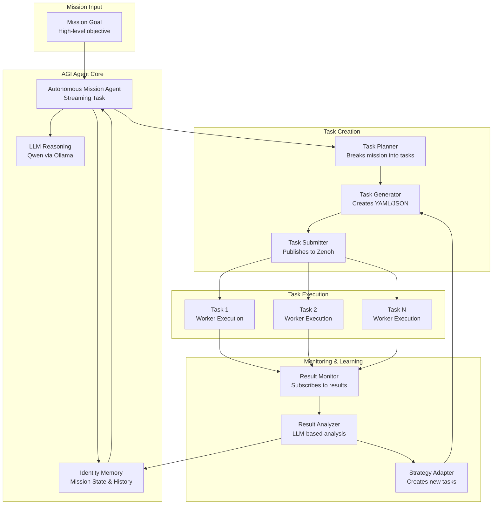

# AGI Operating System Demo: Autonomous Mission Agent

This directory contains examples demonstrating Corebrum as an **AGI Operating System** where AI agents operate autonomously, creating and managing their own tasks in real-time without human intervention.

## 🚀 Quick Start (3 Steps)

```bash
# 1. Start infrastructure (in separate terminals)
zenohd                                    # Terminal 1
corebrum cmos                             # Terminal 2 (or: corebrum daemon)
ollama serve                              # Terminal 3
ollama pull qwen2.5vl:3b                  # Install model

# 2. Create identity and submit agent
IDENTITY_ID=$(corebrum identity create --name "AGI Agent" | grep -o '[a-f0-9-]\{36\}')
corebrum identity enable $IDENTITY_ID memory
corebrum submit --file task_definitions/agi/autonomous_mission_agent.yaml --identity $IDENTITY_ID

# 3. Send a mission
zenoh put -k agi/missions/goals -v '{"mission_type": "research", "topic": "AI", "depth": "basic"}' --encoder json

# Watch it work!
corebrum logs <agent-task-id>
```

**Or use the automated demo script:**
```bash
cd task_definitions/agi
./agi_demo.sh
```

## Overview

The Autonomous Mission Agent showcases how Corebrum enables true AGI operation:

- **Autonomous Task Creation**: AI receives high-level goals and creates executable tasks
- **LLM-Based Planning**: Uses language models (Qwen via Ollama) for reasoning and planning
- **Real-Time Execution**: Tasks execute on Corebrum workers while agent monitors progress
- **Memory-Based Learning**: Uses Corebrum Cortex (identity/memory) to learn and adapt
- **Continuous Operation**: Runs indefinitely, creating new missions and refining strategies

## Architecture



## Components

### 1. Autonomous Mission Agent (`autonomous_mission_agent.yaml`)

The main AGI agent that:
- Receives mission goals via Zenoh topic `agi/missions/goals`
- Uses LLM to break missions into executable tasks
- Dynamically creates task definitions
- Submits tasks programmatically to Corebrum
- Monitors execution and adapts strategy

### 2. Mission Result Monitor (`mission_result_monitor.yaml`)

Monitors task execution:
- Subscribes to task result topics
- Aggregates results from all mission tasks
- Uses LLM to synthesize findings
- Publishes final mission results
- Updates identity memory with learnings

### 3. Task Generator Helpers (`helpers/task_generator.py`)

Python functions for creating task definitions:
- `create_research_task()` - Research tasks
- `create_analysis_task()` - Analysis tasks
- `create_synthesis_task()` - Synthesis tasks
- `create_computation_task()` - Computation tasks

## Prerequisites

1. **Zenoh Router**: Running and accessible
   ```bash
   zenohd
   ```

2. **Corebrum Daemon**: With workers available
   ```bash
   # Option 1: Direct daemon
   corebrum daemon --worker-count 4
   
   # Option 2: Use CMOS (recommended)
   corebrum cmos
   # (CMOS will prompt to launch daemon)
   ```

3. **Ollama**: Running with Qwen model
   ```bash
   # Start Ollama
   ollama serve
   
   # Install Qwen model (required for LLM planning)
   ollama pull qwen2.5vl:3b
   ```

4. **Identity Created**: With memory feature enabled
   ```bash
   # Create identity
   IDENTITY_ID=$(corebrum identity create --name "AGI Mission Agent" | grep -o '[a-f0-9-]\{36\}')
   
   # Enable memory feature
   corebrum identity enable $IDENTITY_ID memory
   
   # Save for later use
   echo "Identity ID: $IDENTITY_ID"
   ```

## Quick Start

### Option 1: Automated Demo Script

The easiest way to run the demo:

```bash
cd task_definitions/agi
./agi_demo.sh
```

This script will:
- Check all prerequisites
- Create an identity
- Submit the AGI agent and result monitor
- Publish a test mission
- Monitor the results

### Option 2: Manual Setup

#### 1. Start Infrastructure

```bash
# Terminal 1: Zenoh router
zenohd

# Terminal 2: Corebrum daemon (or use CMOS)
corebrum daemon --worker-count 4
# OR use CMOS:
# corebrum cmos
# (CMOS will prompt to launch daemon)

# Terminal 3: Ollama (if not already running)
ollama serve
```

#### 2. Install Qwen Model

```bash
ollama pull qwen2.5vl:3b
```

#### 3. Create Identity

```bash
IDENTITY_ID=$(corebrum identity create --name "AGI Mission Agent" | grep -o '[a-f0-9-]\{36\}')
corebrum identity enable $IDENTITY_ID memory
echo "Identity ID: $IDENTITY_ID"
```

#### 4. Submit AGI Agent

```bash
corebrum submit --file task_definitions/agi/autonomous_mission_agent.yaml \
  --identity $IDENTITY_ID
```

**Important**: If you update the agent code, you must resubmit it for changes to take effect. The agent runs as a streaming task, so it uses the code from when it was submitted.

You should see:
- `✅ Job submitted successfully with ID: <task-id>`
- `🌊 Stream-reactive task detected`
- `Subscribed to topic: agi/missions/goals`

#### 5. (Optional) Submit Result Monitor

```bash
corebrum submit --file task_definitions/agi/mission_result_monitor.yaml \
  --identity $IDENTITY_ID
```

### 5. Publish a Mission

```bash
zenoh put -k agi/missions/goals -v '{
  "mission_type": "research",
  "topic": "quantum computing",
  "depth": "comprehensive",
  "deliverable": "analysis report with 5 key findings"
}' --encoder json
```

Or use a simpler mission:

```bash
zenoh put -k agi/missions/goals -v '{
  "mission_type": "research",
  "topic": "artificial intelligence",
  "depth": "basic"
}' --encoder json
```

### 6. Monitor Mission Progress

```bash
# Watch mission status
zenoh subscribe -k agi/missions/*/status

# Watch created tasks
zenoh subscribe -k agi/missions/*/created_tasks

# Watch final results
zenoh subscribe -k agi/missions/*/results
```

### 7. Check Agent Logs

```bash
# Get the agent task ID from the submit output, then:
corebrum logs <agent-task-id>

# Or check all running streams:
corebrum streams
```

### 8. Check Task Execution

```bash
# List all jobs
corebrum jobs

# Check specific task status
corebrum status <task-id>

# Check task logs (to see if there were errors)
corebrum logs <task-id>
```

### 9. View Task Results

There are several ways to view results from AGI mission tasks:

#### Method 1: Check Individual Task Results

```bash
# Get results for a specific task ID (from agent logs)
corebrum results <task-id>

# Example:
corebrum results 91c863a4-3321-4c7c-a3d6-8673126c998a

# If result not found, check status first:
corebrum status <task-id>
corebrum logs <task-id>
```

**Note**: If `corebrum results` shows "Task result not found", the task may:
- Still be running (check with `corebrum status`)
- Have failed (check with `corebrum logs`)
- Not have published results yet (wait a few seconds and try again)

#### Method 2: Subscribe to Zenoh Result Topics

The Result Monitor subscribes to result topics. You can also subscribe directly:

```bash
# Subscribe to all task results
zenoh subscribe -k comp/tasks/*/result

# Subscribe to a specific task result
zenoh subscribe -k comp/tasks/<task-id>/result
```

#### Method 3: Check Mission Results via Result Monitor

If the Result Monitor is running, it will:
1. Collect results from all tasks in a mission
2. Synthesize them using an LLM
3. Publish the final synthesis to `agi/missions/<mission-id>/results`

```bash
# Subscribe to mission results
zenoh subscribe -k agi/missions/*/results

# Or check a specific mission
zenoh subscribe -k agi/missions/<mission-id>/results
```

#### Method 4: Check Agent Logs for Task IDs

The AGI agent logs show all submitted task IDs. Use these IDs to check results:

```bash
# Get agent task ID first
corebrum streams

# Then check agent logs
corebrum logs <agent-task-id> | grep "Submitted task"

# Copy a task ID and check its result
corebrum results <task-id-from-logs>
```

## Common Commands Reference

### Publishing Missions

```bash
# Simple research mission
zenoh put -k agi/missions/goals -v '{"mission_type": "research", "topic": "quantum computing", "depth": "comprehensive"}' --encoder json

# Basic research mission
zenoh put -k agi/missions/goals -v '{"mission_type": "research", "topic": "AI", "depth": "basic"}' --encoder json

# Computation mission
zenoh put -k agi/missions/goals -v '{"mission_type": "computation", "objective": "calculate pi", "computation_inputs": {"operation": "pi_calculation"}}' --encoder json
```

### Monitoring

```bash
# Watch agent logs
corebrum logs <agent-task-id>

# Check running tasks
corebrum jobs

# Watch mission status
zenoh subscribe -k agi/missions/*/status

# Watch created tasks
zenoh subscribe -k agi/missions/*/created_tasks

# Watch results
zenoh subscribe -k agi/missions/*/results
```

## Mission Format

Missions are JSON objects published to `agi/missions/goals`:

### Research Mission

```json
{
  "mission_id": "research_001",
  "mission_type": "research",
  "topic": "quantum computing",
  "depth": "comprehensive",
  "deliverable": "analysis report with at least 5 key findings",
  "requirements": {
    "min_findings": 5,
    "include_applications": true,
    "include_recent_developments": true
  },
  "adaptive": true
}
```

### Computation Mission

```json
{
  "mission_id": "compute_001",
  "mission_type": "computation",
  "objective": "calculate pi to increasing precision",
  "iterations": 5,
  "computation_inputs": {
    "operation": "pi_calculation",
    "start_precision": 5,
    "max_precision": 15
  },
  "learning": true
}
```

### Adaptive Mission

```json
{
  "mission_id": "adaptive_001",
  "mission_type": "research",
  "topic": "artificial general intelligence",
  "adaptive": true,
  "learning_enabled": true,
  "strategy": {
    "initial_approach": "broad_research",
    "refinement_based_on": "findings_quality",
    "max_iterations": 10
  }
}
```

## Mission Workflow

1. **Mission Reception**: Agent receives mission goal via Zenoh
2. **LLM Planning**: Agent uses Qwen to break mission into tasks
3. **Task Creation**: Agent dynamically generates task definitions
4. **Task Submission**: Agent publishes tasks to Corebrum via Zenoh
5. **Execution**: Tasks execute on available Corebrum workers
6. **Monitoring**: Result monitor tracks task completion
7. **Synthesis**: LLM synthesizes all findings into final report
8. **Memory Storage**: Results stored in identity memory for learning
9. **Adaptation**: Agent can create follow-up tasks based on results

## Zenoh Topics

### Input Topics
- `agi/missions/goals` - Mission goals (published by users)
- `agi/missions/*/monitor` - Monitoring requests (published by agent)

### Output Topics
- `agi/missions/{mission_id}/status` - Mission status updates
- `agi/missions/{mission_id}/created_tasks` - List of created task IDs
- `agi/missions/{mission_id}/results` - Final mission results

### Task Topics (Corebrum)
- `comp/queues/user_tasks/announce` - Task announcements (agent publishes here)
- `comp/tasks/{task_id}/result` - Task results (monitor subscribes here)

## Example Missions

See the `examples/` directory for complete mission examples:

- **`research_mission_example.json`** - Research quantum computing
- **`computation_mission_example.json`** - Calculate pi with increasing precision
- **`adaptive_mission_example.json`** - Adaptive research with learning

## Advanced Features

### Self-Improvement Loop

The agent can monitor its own performance and create optimization tasks:

```python
# Agent analyzes its task creation patterns
performance = analyze_performance(mission_history)
if performance["success_rate"] < 0.8:
    # Create optimization task
    optimization_task = create_optimization_task(performance)
    submit_task(optimization_task)
```

### Multi-Mission Coordination

The agent can handle multiple missions simultaneously:

```bash
# Submit multiple missions
zenoh pub -k agi/missions/goals '{"mission_type": "research", "topic": "topic1"}'
zenoh pub -k agi/missions/goals '{"mission_type": "research", "topic": "topic2"}'
zenoh pub -k agi/missions/goals '{"mission_type": "computation", "objective": "..."}'
```

### Memory-Based Learning

The agent learns from past missions:

```python
# Retrieve mission history
history = get_memory(identity_id, "mission_history")

# Analyze successful patterns
successful_patterns = analyze_successful_missions(history)

# Apply to new missions
apply_learned_strategy(new_mission, successful_patterns)
```

### Cognitive Traces

The agent records its reasoning process:

```python
trace = {
    "mission_id": mission_id,
    "reasoning": "Breaking mission into tasks because...",
    "decisions": [
        {"decision": "create_research_task", "reason": "..."},
        {"decision": "create_analysis_task", "reason": "..."}
    ],
    "timestamp": datetime.now().isoformat()
}
put_memory(identity_id, f"trace_{mission_id}", trace)
```

## Integration with ROS2

The AGI agent can create ROS2 control tasks for physical missions:

```json
{
  "mission_type": "robotics",
  "objective": "navigate to target location",
  "sensor_inputs": ["camera", "lidar", "odometry"],
  "adaptive": true
}
```

The agent would create tasks that:
- Process sensor data
- Make navigation decisions
- Publish control commands
- Adapt based on sensor feedback

## Troubleshooting

### Tasks Stuck in "Pending" Status

If tasks show "pending" status and never get picked up:

**Note**: Tasks submitted programmatically by the AGI agent use a different format than YAML-submitted tasks. The agent generates tasks in Rust `TaskDefinition` format with `source: {Inline: {code: ...}}` instead of `compute_logic`. If tasks remain pending, check:

1. **Task Format**: Verify the generated task uses `source: {Inline: {code: ...}}` format (check agent logs)
2. **Worker Capabilities**: Ensure workers have matching capabilities (e.g., `python`)
3. **Scheduler Processing**: The scheduler should process tasks from `comp/queues/user_tasks/announce` - check scheduler logs for errors

#### 1. Check if Workers are Running

```bash
# Check network status (shows available workers)
corebrum netstat

# Check if daemon is running
corebrum daemon --status

# Or check via API (if web UI is running)
curl http://localhost:8080/api/v1/workers
```

**Solution**: If no workers are shown, start a worker:
```bash
# Start Corebrum daemon (which includes workers)
corebrum daemon --zenoh-router tcp://127.0.0.1:7447
```

#### 2. Check Task Definition Format

Tasks might be pending if the task definition has errors. Check the agent logs:

```bash
# Get agent task ID
corebrum streams

# Check agent logs for errors
corebrum logs <agent-task-id> | grep -i error
```

#### 3. Verify Zenoh Connection

```bash
# Check if Zenoh router is running
zenoh info

# Test Zenoh connectivity
zenoh put -k test/key -v "test"
zenoh get -k test/key
```

#### 4. Check Scheduler Status

The scheduler should be running as part of the daemon. Verify:

```bash
# Check daemon logs
corebrum daemon --status

# Or check if tasks are being announced
zenoh subscribe -k comp/queues/user_tasks/announce
```

#### 5. Restart Daemon

If workers aren't picking up tasks, try restarting:

```bash
# Stop daemon
pkill -f "corebrum daemon"

# Start fresh
corebrum daemon --zenoh-router tcp://127.0.0.1:7447
```

### Tasks Complete But No Results

If tasks show "completed" but `corebrum results` shows "not found":

1. **Check Zenoh topics directly** - Results are published to Zenoh:
   ```bash
   zenoh subscribe -k comp/tasks/<task-id>/result
   ```

2. **Check Result Monitor logs** - The monitor should receive results:
   ```bash
   corebrum logs <monitor-task-id>
   ```

3. **Wait a few seconds** - Results may take time to propagate

## Troubleshooting

### IndentationError (Fixed in Corebrum v0.2.181+)

If you see `IndentationError: unexpected indent` when submitting the agent, this was a bug in Corebrum that has been fixed. Make sure you're running Corebrum v0.2.181 or later.

**If you still see this error:**
1. Update Corebrum to the latest version
2. Rebuild Corebrum: `cargo build --release`
3. Restart the daemon
4. Check Corebrum logs for more details: `corebrum logs <task-id>`

### Agent Not Receiving Missions

- Check Zenoh connectivity: `zenoh info`
- Verify topic name: `zenoh subscribe -k agi/missions/goals`
- Check agent is running: `corebrum streams`

### LLM Planning Fails or Times Out

- Verify Ollama is running: `curl http://localhost:11434/api/tags`
- Check model is available: `ollama list`
- Install Qwen model: `ollama pull qwen2.5vl:3b`
- Review agent logs: `corebrum logs <agent-task-id>`
- **Note**: If LLM times out, the agent will use a fallback plan (this is expected behavior)

### Tasks Not Executing

- Check workers are available: `corebrum netstat`
- Verify task format is valid
- Check worker capabilities match task requirements

### Results Not Appearing

- Verify result monitor is running: `corebrum streams`
- Check result topics: `zenoh subscribe -k comp/tasks/*/result`
- Review monitor logs: `corebrum logs <monitor-task-id>`
- Check if tasks completed: `corebrum jobs`

## Best Practices

1. **Start Simple**: Begin with basic research missions before complex ones
2. **Monitor Closely**: Watch mission status and task creation
3. **Use Identity Memory**: Enable memory feature for learning
4. **Iterate Gradually**: Let agent learn from each mission
5. **Review Traces**: Check cognitive traces to understand agent reasoning

## Extending the Agent

### Add New Mission Types

1. Create mission template in `mission_templates/`
2. Add planning logic in agent code
3. Create task generator function
4. Add example mission

### Custom Task Types

1. Add generator function to `helpers/task_generator.py`
2. Update LLM prompt to recognize new type
3. Add task creation logic in agent

### Integration Points

- **MCP Servers**: Agent can call MCP tools for external capabilities
- **ROS2**: Agent can create robot control tasks
- **Storage**: Agent can use Corebrum storage for data persistence
- **Hive Memory**: Agent can share learnings with other agents

## Related Examples

- **Identity & Memory**: See `../identity/` for memory usage patterns
- **Streaming Tasks**: See `../ros2/` for streaming task examples
- **MCP Integration**: See `../mcp/` for MCP tool usage
- **Sequential Pipelines**: See `../sequential/` for task chaining

## Next Steps

1. Experiment with different mission types
2. Create custom task generators
3. Integrate with physical robots via ROS2
4. Build multi-agent systems using hive memory
5. Implement self-improvement loops

---

**Welcome to the AGI Operating System!** 🤖🧠
